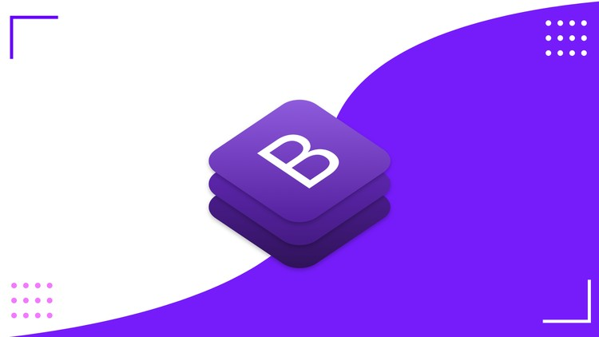

# 🎮 GameLytics
GameLytics is a school project that I made in my first year to learn Bootstrap. The assignment was to design a responsive page and code it with Bootstrap. I was a lot into gaming at that time and thought why not make something that correlates with my interests so I made a gaming news website.
  
## 👨‍💻 How I made it

  
I've done a couple of web designs before and wanted to try designing a dark themed site. I used normal HTML5 & CSS3 to create this site with the addition of Bootstrap. I fell in love with Bootstrap it was easy to learn and it performed. With the documentation making the site ready for different sizes was a breeze and I got a 10/10 for this project.
  
## 👨‍🏫 What I learned
- [x] A bit of dark-themed design
- [x] Bootstrap grid and some components
  
## 📌 What I would do differently
- It's been a while since I made this project so I would rewrite the code to make more sense as I have more experience now.
- I would add an API to give me game information to make the site look more full
- I would freshen up the design more to improve UX and add a little more color to the site.